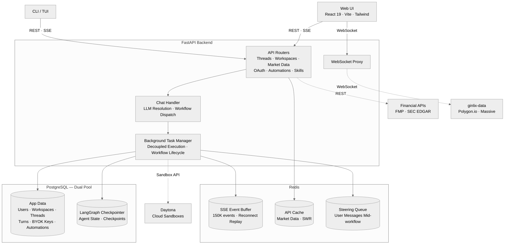
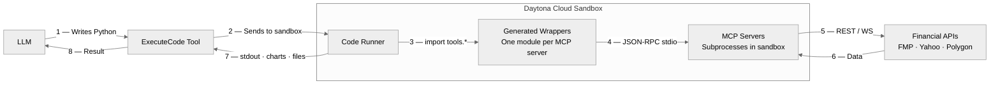
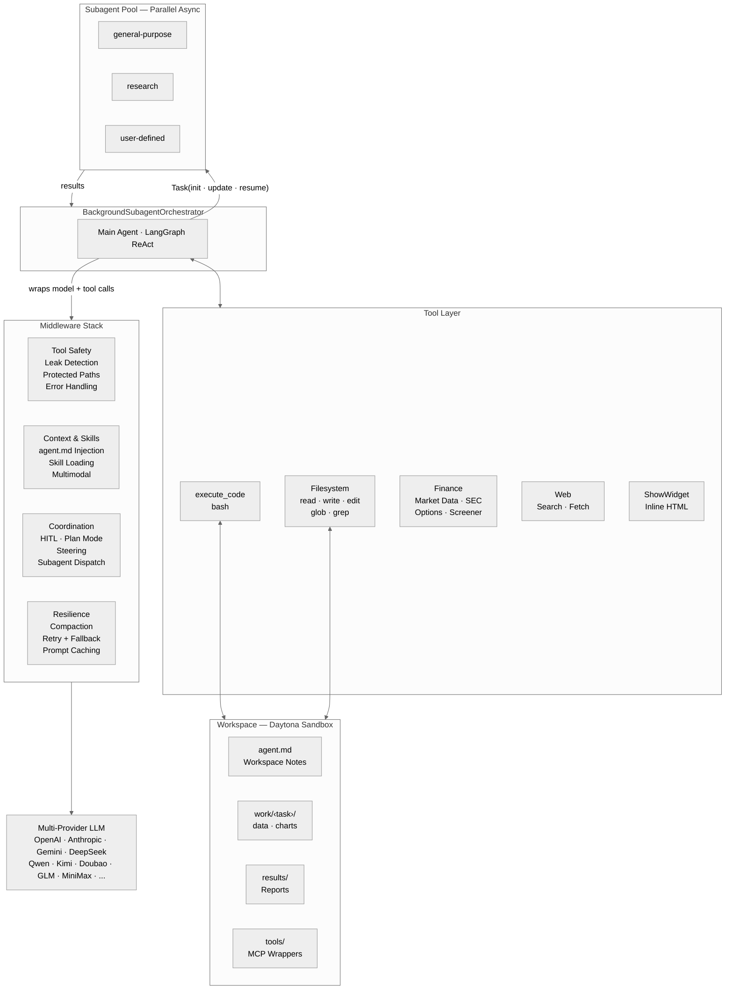

<p align="center">
  
  <br>
  <strong>A vibe investing agent harness</strong>
  <br>
  LangAlpha is built to help interpret financial markets and support investment decisions.
  <br><br>
  
  <a href="https://github.com/langchain-ai/langchain"></a>
  
</p>

<p align="center">
  <a href="#getting-started">Getting Started</a> &bull;
  <a href="docs/api/README.md">API Docs</a> &bull;
  <a href="src/ptc_agent/">Agent Core</a> &bull;
  <a href="src/server/">Backend</a> &bull;
  <a href="web/">Web</a> &bull;
  <a href="libs/ptc-cli/">TUI</a> &bull;
  <a href="skills/">Skills</a> &bull;
  <a href="mcp_servers/">MCP</a>
</p>

<p align="center">
  <video src="https://github.com/user-attachments/assets/56ec23b5-e9af-46ab-8505-66a7dff822a4" autoplay loop muted playsinline width="900"></video>
</p>
<p align="center"><em>Pin a curated news brief from the dashboard, kick off idea generation, and dispatch parallel subagents to screen the market — then get five long/short pair-trade ideas in an inline interactive dashboard, calibrated to your book.</em></p>

## Why LangAlpha

Every AI finance tool today treats investing as one-shot: ask a question, get an answer, move on. But real investing is Bayesian — you start with a thesis, new data arrives daily, and you update your conviction accordingly. It's an iterative process that unfolds over weeks and months: refining theses, revisiting positions, layering new analysis on top of old. No single prompt captures that.

### *From vibe coding to vibe investing*

Inspired by software engineering: a codebase persists, and every commit builds on what came before. Code agent harnesses like Claude Code and OpenCode succeeded by building agents that embrace this pattern, exploring existing context and building on prior work. LangAlpha brings that same insight: give the agent a persistent workspace, and research naturally compounds.

In practice, you create a workspace per research goal ("Q2 rebalance", "data center demand deep dive", "energy sector rotation"). The agent interviews you about your goals and style, produces its first deliverable, and saves everything to the workspace filesystem. Come back tomorrow and your files, threads, and accumulated research are still there.

## Features Highlights

- **Progressive Tool Discovery** — Any MCP tools loaded as summary in context and full documentation dumped into the workspace, allowing the agent to discover and use tools truly on demand. Also supports binding json tools with skills and only expose to agent when skill is activated.
- **Programmatic Tool Calling (PTC)** — The agent writes and executes Python to process financial data from mcp servers instead of pouring raw data into the LLM context window, enabling complex multi-step analysis while dramatically reducing token waste.
- **Financial data ecosystem** — Multi-tier provider hierarchy with native tools for quick lookups and MCP servers for bulk data processing, charting, and multi-year analysis in sandboxes.
- **Persistent workspaces** — Each workspace maps to a dedicated sandbox with structured directories and a workspace notes file (`agent.md`) that compounds research across sessions and threads. A separate long-term memory store (`.agents/user/memory/`, `.agents/workspace/memory/`) persists durable user preferences and cross-sandbox knowledge, and a user-managed memo store (`.agents/user/memo/`) lets you upload PDFs and markdown research notes that the agent can read on demand.
- **Skills for Financial Research** — Pre-built workflows for DCF models, initiating coverage reports, earnings analysis, morning notes, document generation, and more — activatable by slash command or auto-detection.
- **Finance Research Workbench** — Web UI with inline financial charts, multi-format file viewer, TradingView charting, real-time WebSocket market data, agent-drawn chart annotations, a per-turn source-provenance panel, shareable conversations, and subagent monitoring.
- **Multi-provider model layer** — Provider-agnostic LLM abstraction and automatic failover on error.
- **Automations** — Schedule recurring or one-shot tasks, or set price-triggered automations that fire when a stock or index hits a real-time price condition.
- **Secretary** — Flash agent doubles as a secretary: create and manage workspaces, dispatch deep PTC analyses in the background, monitor running tasks, and retrieve results — all through conversational commands with human-in-the-loop approval.
- **Agent swarm** — Parallel async subagents with isolated context windows, preloaded toolset/skills, mid-execution steering, checkpoint-based resume, and live progress monitoring in the UI.
- **Live steering** — Send follow-up messages while the agent/subagent is working to course-correct, clarify, or redirect without waiting for it to finish.
- **Middleware stack** — a deep, composable middleware stack handling skill loading, plan mode, multimodal input, auto-compaction, and context management to support long-running agent sessions.
- **Security & workspace vault** — Encryption at rest via pgcrypto, automatic credential leak detection and redaction, sandboxed execution, and per-workspace secret storage for safe agent access
- **Channel integrations** — Use LangAlpha from Slack, Discord, Feishu, and Telegram, plus email delivery for scheduled results.
- **Production-ready infrastructure** — SSE-streamed agent activity with Redis-buffered reconnection replay, background execution decoupled from HTTP connections, and PostgreSQL-backed state persistence.

## What Powers It

**System Architecture**




### Multi-Provider Model Layer

LangAlpha runs on a provider-agnostic model layer that abstracts across multiple LLM backends. The same middleware stack, tools, and workflows work regardless of which model is driving them. It ships with two modes:

- **PTC mode** for deep, multi-step investment research. Strong reasoning drives multi-step analysis where the agent plans its approach, thinks through financial data, and writes code for complex analysis. Long context lets it cross-reference SEC filings and research reports in a single pass.
- **Flash mode** for fast conversational responses and workspace orchestration: quick market lookups, chart-and-chat in MarketView, lightweight Q&A, and a secretary that manages workspaces, dispatches deep PTC analyses in the background, and relays results back through natural conversation.

**Bring your own model** — Use your existing AI subscriptions and API keys directly. Connect ChatGPT or Claude subscriptions via OAuth (OpenAI Codex OAuth, Claude Code OAuth), use coding plans from Kimi (Moonshot), GLM (Zhipu), MiniMax, or Doubao (Volcengine), or supply your own API keys for any supported provider via BYOK. All keys are encrypted at rest via PostgreSQL pgcrypto (see [Security](#security)).

**Model resilience** — automatic retries on transient errors, then failover to a configured fallback model. Reasoning effort (`low`/`medium`/`high`) is normalized across providers automatically.

### Programmatic Tool Calling (PTC) and Workspace Architecture

Most AI agents interact with data through one-off JSON tool calls which dump the result into the context window directly. Programmatic Tool Calling flips this: instead of passing raw data through the LLM, the agent writes and executes code inside a [Daytona](https://www.daytona.io/) cloud sandbox that processes data locally and returns only the final result. This dramatically reduces token waste while enabling analysis that would otherwise exceed context limits.

**PTC Execution Flow**




In addition, the workspace environment enables persistence beyond a single session. Each sandbox has a structured directory layout — `work/<task>/` for per-task working areas (data, charts, code), `results/` for finalized reports, and `data/` for shared datasets — so intermediate results survive across sessions. At the root sits `agent.md`, a workspace notes file that the agent maintains across threads: workspace goals, key findings, a thread index, and a file index of important artifacts. A middleware layer injects `agent.md` into every model call, so the agent always has full context of prior work without re-reading files. Orthogonal to this, a store-backed long-term memory system (`.agents/user/memory/`, `.agents/workspace/memory/`) captures durable user preferences and cross-sandbox knowledge that survives workspace resets, and a user-managed memo store (`.agents/user/memo/`) holds documents you upload — PDFs are text-extracted server-side and metadata is generated asynchronously by an LLM so the agent can find and cite them by topic. Each workspace supports multiple conversation threads tied to a single research goal.

<p align="center">
  
</p>
<p align="center"><em>Each workspace maps to a persistent sandbox — organize research by theme, portfolio, or thesis.</em></p>

<p align="center">
  
</p>
<p align="center"><em>The agent writes code to build interactive dashboards — here, a Mag 7 + Semiconductors catalyst calendar.</em></p>

### Financial Data Ecosystem

While PTC excels at complex work like multi-step data processing, financial modeling, and chart creation, spinning up code execution for every data lookup is overkill. So we also built a native financial data toolset that transforms frequently used data into an LLM-digestible format. These tools also come with artifacts that render directly in the frontend, giving the human layer immediate visual context alongside the agent's analysis.

**Native tools** for quick reference via direct tool calls:

- **Company overview** with real-time quotes, price performance, key financial metrics, analyst consensus, and revenue breakdown
- **SEC filings** (10-K, 10-Q, 8-K) with earnings call transcripts and formatted markdown for citation
- **Market indices** and **sector performance** for broad market context
- **Web search** (Tavily, Serper, Bocha) — manifest-driven provider selection with tiered depth (fast lookup to deep research), plus image search and AI research modes, selectable per user — and **web crawling** with circuit breaker fault tolerance

**MCP servers** for raw data consumed through PTC code execution:

- **Price data** for OHLCV time series across stocks, commodities, crypto, and forex, plus short interest and short volume analytics
- **Fundamentals** for multi-year financial statements, ratios, growth metrics, valuation, insider trades, dividends and splits, share float, key executives, and technical indicators
- **Macro economics** for GDP, CPI, unemployment, Fed funds rate, treasury yield curve (1M–30Y), country risk premiums, economic calendar, and earnings calendar
- **Options** for options chain with filtering, historical OHLCV for option contracts, and real-time bid/ask snapshots
- **Yahoo Finance suite** (price, fundamentals, analysis, market) for keyless coverage of statements, analyst ratings, holders, screening, and calendars
- **X (Twitter)** read-only post search, user/tweet lookup, and thread fetch for sentiment and event tracking, plus a **scraping** server for JS-rendered and anti-bot-protected pages

The agent picks the right layer automatically: native tools for fast lookups that fit in context, MCP tools when the task requires bulk data processing, charting, or multi-year trend analysis in the sandbox.

MCP servers are configurable per workspace. Built-in servers can be disabled individually, and custom HTTP or stdio servers — including ones that read credentials from the [workspace vault](#workspace-vault) — can be added through the API or UI, taking effect within seconds without a restart.

#### Data Provider Fallback Chain

LangAlpha supports a three-tier data provider hierarchy. Each tier is optional — the system gracefully degrades when higher tiers are unavailable:


| Tier | Provider                          | Key Required      | What It Adds                                                                               |
| ---- | --------------------------------- | ----------------- | ------------------------------------------------------------------------------------------ |
| 1    | **ginlix-data** (hosted proxy)    | `GINLIX_DATA_URL` | Real-time WebSocket price feed, intraday data, extended trading hour data, options data    |
| 2    | **FMP** (Financial Modeling Prep) | `FMP_API_KEY`     | High-quality fundamentals, financial statements, macro data, analyst data                  |
| 3    | **Yahoo Finance** (yfinance)      | *None — free*     | Price history, basic fundamentals, earnings, holdings, insider transactions, ESG, screener |


All tiers are enabled by default. To run with **free data only** (Yahoo Finance), run `make config` with prompted selection. You can also edit `agent_config.yaml` manually.

> [!NOTE]
> Yahoo Finance data is community-sourced and has limitations: no intraday data below 1-hour intervals, delayed quotes, limited macro coverage, and occasional rate limiting. An `FMP_API_KEY` is strongly recommended ([free tier available](https://site.financialmodelingprep.com/)).

### Financial Research Skills

The agent ships with 23 pre-built financial research skills, each activatable by slash command or automatic detection. Skills follow the [Agent Skills Spec](https://agentskills.io/specification) and can be extended by dropping a `SKILL.md` file into the workspace.


| Category                 | Skills                                                                                    |
| ------------------------ | ----------------------------------------------------------------------------------------- |
| **Valuation & Modeling** | DCF Model, Comps Analysis, 3-Statement Model, Model Update, Model Audit                   |
| **Equity Research**      | Initiating Coverage (30–50pg report), Earnings Preview, Earnings Analysis, Thesis Tracker |
| **Market Intelligence**  | Morning Note, Catalyst Calendar, Sector Overview, Competitive Analysis, Idea Generation, X Research |
| **Document Generation**  | PDF, DOCX, PPTX, XLSX, HTML — create, edit, extract                                       |
| **Operations**           | Investment Deck QC, Scheduled Automations, User Profile & Portfolio                       |


Acknowledgement: some of skills are adapted from [anthropics/financial-services-plugins](https://github.com/anthropics/financial-services-plugins).

<p align="center">
  
</p>
<p align="center"><em>The Comps Analysis skill ships an Excel model and a PDF report — with implied price ranges from peer-group multiples.</em></p>

### Multimodal Intelligence

The agent natively reads images (PNG, JPG, GIF, WebP) and PDFs — the multimodal middleware intercepts file reads, downloads content from the sandbox or URLs, and injects it as base64 into the conversation for direct visual interpretation. In MarketView, the user's live candlestick chart can be captured and sent to the agent as multimodal context — the capture includes both the chart image and structured metadata (symbol, interval, OHLCV, moving averages, RSI, 52-week range) so the agent can reason about both the visual pattern and the underlying data.

<p align="center">
  
</p>
<p align="center"><em>MarketView sends the live chart to the agent for real-time technical analysis.</em></p>

### Agent-Drawn Chart Annotations

Ask the agent to mark up the MarketView chart and it draws directly on the canvas — price levels, trendlines, Fibonacci retracements, event badges, rectangles, and text markers. Annotations stream in live over SSE, persist per workspace and per `symbol:timeframe` pair (a drawing on `NVDA:1day` stays separate from `NVDA:1hour`), and replay on reconnect. When the conversation happens outside MarketView, the chat transcript shows a mini-preview card with the annotation legend and a one-click link to the live chart. The chart-annotation skill loads automatically whenever a message is sent from MarketView, so the agent always knows which ticker and timeframe "the chart" refers to.

### Automations

The agent can schedule its own tasks from within a conversation — no separate UI needed. Users can also manage automations from the dedicated Automations page with full CRUD, execution history, and manual trigger. All automation types share the same `AutomationExecutor`, configurable agent mode (PTC or Flash), and automatic disabling after consecutive failures.

**Time-based** — Standard cron expressions for recurring schedules ("run this analysis every Monday at 9 AM") and one-shot datetime scheduling for single future executions.

**Price-triggered** — Set a price target or percentage move on any stock or major index, and the agent executes your instructions the moment the condition is met. A `PriceMonitorService` subscribes to a shared upstream WebSocket connection to [ginlix-data](https://github.com/ginlix-ai/ginlix-data) for real-time ticks (stocks on the realtime tier, indices on the delayed tier). Redis-based deduplication prevents duplicate triggers across server instances.


| Condition                    | Example                                        |
| ---------------------------- | ---------------------------------------------- |
| Price above / below          | Trigger when AAPL crosses $200                 |
| Percent change above / below | Trigger when SPX moves +2% from previous close |


Conditions can be combined (AND logic), and each price automation supports **one-shot** (fire once) or **recurring** mode with a configurable cooldown (minimum 4 hours, or once per trading day by default).

> [!NOTE]
> Price-triggered automations require the real-time WebSocket feed from ginlix-data. During the beta, this feature is available exclusively on the [hosted platform](https://ginlix.ai). Broader WebSocket data source support is planned for future releases.

<p align="center">
  
</p>
<p align="center"><em>Schedule recurring research — here, Mag 7 pre-earnings analyses run automatically ahead of each report.</em></p>

**Agent Architecture**




### Agent Swarm

The core agent runs on [LangGraph](https://github.com/langchain-ai/langgraph) and spawns parallel async subagents via a `Task()` tool. Subagents execute concurrently with isolated context windows, preventing drift in long reasoning chains. Each subagent returns synthesized results back to the main agent, keeping the orchestrator lean. The main agent can choose to wait for a subagent's result or continue other pending work. You can also switch to the **Subagents** view in the UI to see their progress in real time (web frontend only).

Beyond simple dispatch, the main agent can send follow-up instructions to a still-running subagent, or resume a completed one with full context for iterative refinement. If the server restarts, subagent state is automatically reconstructed from its last checkpoint.

<p align="center">
  
</p>
<p align="center"><em>Research subagents run in parallel across the compute chain — results merge into an interactive AI compute timeline spanning NVIDIA, Google, AMD, AWS, and the rest of the industry.</em></p>

### Middleware Stack

The agent ships with a middleware stack, including:

- **Live steering** — agents can take wrong turns, chase irrelevant data, or misunderstand your intent mid-analysis. Steering lets you course-correct without waiting. Send a follow-up message at any time while the agent is working — updated instructions, clarifications, or entirely new questions — and the agent picks it up before its next step, as if you had said it in real time. Steering works at every level: redirect the main agent, send follow-ups to individual background subagents, or let the system gracefully return unconsumed messages to your input box if the workflow finishes first. No work is lost, no restarts required.
- **Dynamic skill loading** via a `LoadSkill` tool that lets the agent discover and activate skill toolsets on demand, keeping the default tool surface lean while making specialized capabilities available when needed
- **Multimodal** intercepts file reads for images and PDFs, downloads content from the sandbox or URLs, and injects it as base64 into the conversation so multimodal models can interpret them natively
- **Plan mode** with human-in-the-loop interrupts lets you review and approve the agent's strategy before execution
- **Auto-compaction** compresses conversation history when approaching token limits, preserving key context while freeing space
- **Context management** automatically offloads large tool results to the workspace filesystem, keeping a short preview in context, and compacts long conversations as they grow — summarizing older turns while keeping the full transcript recoverable in the workspace. Research sessions can run indefinitely without hitting context limits.

See [`src/ptc_agent/agent/middleware/`](src/ptc_agent/agent/middleware/) for the full set.

Acknowledgement: some of middleware components are adapted or inspired by the implementation in [LangChain DeepAgents](https://github.com/langchain-ai/deepagents).

### Streaming and Infrastructure

The server streams all agent activity over SSE: text chunks, tool calls with arguments and results, subagent status updates, file operation artifacts, and human-in-the-loop interrupts. Every agent decision is fully traceable in the UI.

Workflows run as independent background tasks, fully decoupled from the HTTP/SSE connection. If the browser tab closes or the network drops, the agent keeps working. On reconnect, up to 150,000 buffered events replay so the client picks up exactly where it left off.

PostgreSQL backs LangGraph checkpointing, conversation history, and user data (watchlists, portfolios, preferences), so agent state and user context persist across sessions. Redis buffers SSE events so that browser refreshes and network drops do not lose in-flight messages: the client reconnects and replays automatically. User data is exposed to the agent as virtual JSON files backed directly by the database — reads serialize live rows on demand and writes apply in a single validated transaction, with no sandbox sync round-trip — while skills are synced to the sandbox on session init via a manifest-based cache, re-uploaded only when they change. See the full [API reference](docs/api/README.md) for details.

### Source Provenance

Every external data source the agent touches is traced and surfaced. A provenance middleware records each web search, page fetch, SEC filing, market-data call, MCP tool invocation, and workspace file read — including accesses made by background subagents — and emits a `provenance` stream event per source, none of which enters the LLM context. The UI renders these as a Sources panel beside each turn: sources grouped by type, favicons for web origins, and a detail view exposing the provider, timestamp, captured arguments, a content fingerprint, and a snippet. A *This turn / All sources* toggle reveals the full data footprint across an entire thread, and clicking a file or memo source opens it directly in the workspace file panel — a fully auditable trail of the data behind every research output.

## Security & Workspace Vault

LangAlpha applies a layered security model across credentials, code execution, and user-supplied secrets.

**Encryption at rest** — All sensitive data (BYOK API keys, OAuth tokens, vault secrets) is encrypted inside PostgreSQL using `pgcrypto`. Plaintext is never stored in the database.

**Credential leak detection** — Every tool output is scanned before it reaches the LLM context. The middleware resolves all known secret values (MCP server keys, sandbox tokens, vault secrets) and redacts any match as `[REDACTED:KEY_NAME]`. The same redaction applies to human-facing surfaces — file reads and downloads are scrubbed before reaching the client.

**Sandboxed code execution** — Each workspace runs in its own [Daytona](https://www.daytona.io/) cloud sandbox with a dedicated filesystem and network boundary. Protected path guards prevent the agent from accessing internal system directories — blocking both tool input (short-circuiting the call before execution) and tool output (redacting leaked paths).

### Workspace Vault

Each workspace has a built-in secret vault for storing API keys and credentials that the agent can use during code execution — useful for accessing third-party data sources (brokerage APIs, external data vendors, etc.) or building LLM-powered workflows inside the workspace. Store a secret once in the UI, and it's available to every agent session in that workspace via a simple Python API:

```python
from vault import get, list_names, load_env

api_key = get("MY_API_KEY")       # retrieve a single secret
names = list_names()               # list available secret names
load_env()                         # bulk-load all secrets as env vars
```

Vault secrets inherit every protection layer above — encrypted at rest, redacted from all agent and human-facing output, and blocked from direct file access. Only the workspace owner can create, update, reveal, or delete secrets.

## Frontend

The web UI is more than a chat interface — it's a full research workbench:

- **Configurable dashboard** — start from a preset layout (Morning Brief, Trader, Researcher, Agent Desk, Trader (TradingView), or Portfolio Steward) or build your own from a widget gallery covering markets, intelligence, personal context, agent surfaces, and workspace shortcuts
- **Inline financial charts** — tool results render as interactive sparklines, bar charts, and overview cards directly in the chat thread
- **Inline HTML widgets** — the agent can render interactive HTML/SVG visualizations (Chart.js charts, metric cards, data tables) directly in the chat via the `ShowWidget` tool, with theme-aware styling and sandboxed iframes
- **HTML research reports** — the agent writes full self-contained HTML documents to `results/`, served with real browser semantics (scripts run, CDN libraries load, relative assets resolve), viewable fullscreen and exportable to PDF — distinct from inline widgets and live dashboards
- **Multi-format file viewer** — PDF (paginated, zoomable), Excel, CSV, HTML preview, and source code (Monaco editor with diff mode) — all viewable inline without download
- **TradingView charting** — full TradingView Advanced Chart with drawing tools, indicators, and professional candlestick styling
- **Live market data** — real-time WebSocket price feed with 1-second tick resolution (US equities), extended hours visualization, and multiple moving average overlays
- **Agent-drawn chart annotations** — the agent marks up the MarketView chart with price levels, trendlines, Fibonacci retracements, and event badges, persisted per `symbol:timeframe` and previewed inline in chat
- **Shareable conversations** — one-click sharing with granular permissions (toggle file browsing and download access), replay via public URL
- **Real-time subagent monitoring** — watch each background task's streaming output and tool calls live, with the ability to send mid-execution instructions
- **Source provenance panel** — every turn lists the external sources the agent accessed (web, SEC filings, market data, MCP tools, files) with favicons, content fingerprints, and a per-thread scope toggle
- **Automations** — CRUD management with cron builder, execution history, manual trigger, and price-triggered automations that fire when a stock or index hits a real-time price condition

<p align="center">
  
</p>
<p align="center"><em>The dashboard surfaces market indices, a personalized brief, and your watchlist — any tile can be pinned to the agent as chat context to kick off a research thread.</em></p>

<table align="center">
  <tr>
    <td width="50%">
      
    </td>
    <td width="50%">
      
    </td>
  </tr>
  <tr>
    <td align="center"><em>Start from a curated preset — Morning Brief, Agent Desk, Researcher, or Trader.</em></td>
    <td align="center"><em>Or compose your own from the widget gallery — markets, intelligence, personal, agent, and workspace.</em></td>
  </tr>
</table>

## Channel Integrations

Use LangAlpha from the tools you already work in. The integration gateway relays messages between messaging platforms and the core agent, with each channel receiving responses in its native format. Channel integrations are available exclusively on our hosted service with one-click setup and quick account binding — visit [integrations](https://ginlix.ai/account/integrations) to get started.


| Feature                        | Slack | Discord | Feishu | Telegram | WhatsApp |
| ------------------------------ | ----- | ------- | ------ | -------- | -------- |
| Rich text / markdown           | ✅     | ✅       | ✅      | ✅        | 🔜       |
| File upload (user → agent)     | ✅     | ✅       | ✅      | ❌        | ➖        |
| File download (agent → user)   | ✅     | ✅       | ✅      | ❌        | ➖        |
| Image rendering                | ✅     | ✅       | ✅      | ❌        | ➖        |
| Human-in-the-loop interrupts   | ✅     | ✅       | ✅      | ⚠️       | ➖        |
| Subagent tracking              | ✅     | ✅       | ✅      | ✅        | 🔜       |
| Workspace / model selection    | ✅     | ✅       | ✅      | ✅        | 🔜       |
| Automation delivery (outbound) | ✅     | ✅       | ❌      | ➖        | ➖        |
| Simplified account linking     | ✅     | ✅       | ❌      | ❌        | ➖        |
| Slash commands                 | ✅     | ✅       | ✅      | ✅        | ➖        |


Slack and Discord offer native channels and thread-level groups, which map naturally to LangAlpha workspaces and threads — context is managed natively. Telegram and WhatsApp lack these primitives, so they run a simplified orchestration mode. Feishu has full messaging and card-based UI with OAuth coming soon. Telegram has partial support with full coverage coming soon. WhatsApp is planned.

## Getting Started

> [!TIP]
> **Don't want to self-host?** Try the [hosted version](https://ginlix.ai) — it includes full data infrastructure (FMP, real-time market data, cloud sandboxes) out of the box. Bring your own LLM key (BYOK) and start immediately with no setup.

You can start LangAlpha with **nothing but Docker** — no API keys for data, no cloud sandbox. Just Docker for infrastructure and your own LLM subscription for the AI model.

```bash
git clone https://github.com/ginlix-ai/langalpha.git
cd langalpha
make config   # interactive wizard — creates .env, configures LLM, data sources, sandbox, and search
make up       # starts PostgreSQL, Redis, backend, and frontend
```

- **Frontend:** [http://localhost:5173](http://localhost:5173)
- **Backend API:** [http://localhost:8000](http://localhost:8000) (interactive docs at `/docs`)
- **Verify:** `curl http://localhost:8000/health`

For the full experience, the wizard will prompt you for optional keys — or add them to `.env` later:


| Key                                  | What It Unlocks                                                                                                         |
| ------------------------------------ | ----------------------------------------------------------------------------------------------------------------------- |
| `DAYTONA_API_KEY`                    | Persistent cloud sandboxes with cross-session workspace support ([daytona.io](https://www.daytona.io/))                 |
| `FMP_API_KEY`                        | High-quality fundamentals, macro, SEC filings, options ([free tier available](https://site.financialmodelingprep.com/)) |
| `SERPER_API_KEY` or `TAVILY_API_KEY` | Web search                                                                                                              |
| `LANGSMITH_API_KEY`                  | LangSmith tracing for LangGraph runs                                                                                    |
| `OTEL_EXPORTER_OTLP_ENDPOINT`        | OpenTelemetry traces and metrics to any OTLP backend (Jaeger, Grafana Tempo, Datadog, Honeycomb, ...)                   |
| `SANDBOX_PROVIDER`                   | Override the sandbox provider (`daytona` or `docker`); auto-detected from `DAYTONA_API_KEY` when unset                  |


> [!NOTE]
> Without external service keys you get a functional but reduced experience: Yahoo Finance provides free price history, fundamentals, earnings, and analyst data, but lacks real-time quotes, intraday tick data, macro economics, and options analytics. The Docker sandbox replaces Daytona cloud sandboxes — full PTC code execution works, but with a downgraded security and isolation. Add keys incrementally to unlock more capabilities.

Run `make help` to see all available commands. For manual setup without Docker, see [CONTRIBUTING.md](CONTRIBUTING.md#manual-setup).

## Documentation

- **[API Reference](docs/api/README.md)** with endpoints for chat streaming, workspaces, workflow state, and more
- **Interactive API docs** at `http://localhost:8000/docs` when the server is running

## Contact

For partnerships, collaborations, or general inquiries, reach out to [contact@ginlix.ai](mailto:contact@ginlix.ai).

## Disclaimer

LangAlpha is a research tool, not a financial advisor. Nothing produced by this software constitutes investment advice, a recommendation, or a solicitation to buy or sell any security. All output is for informational and educational purposes only. Use at your own discretion — always do your own due diligence before making investment decisions.

## License

Apache License 2.0
