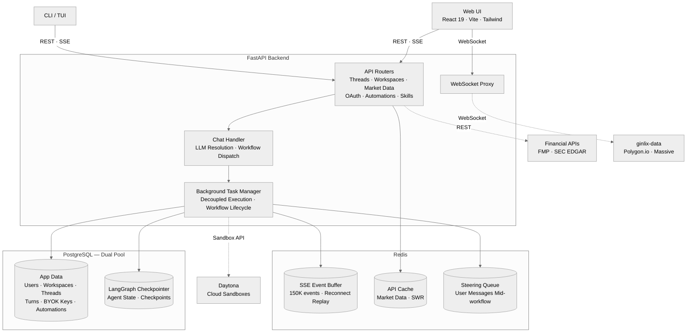
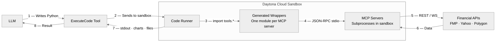
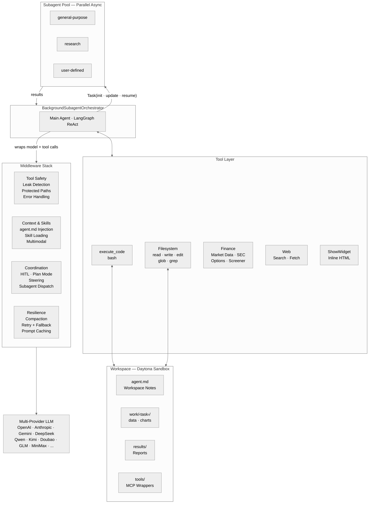

<p align="center">
  
  <br>
  <strong>面向 vibe investing 的 agent harness</strong>
  <br>
  LangAlpha 帮你解读金融市场，辅助投资决策。
  <br><br>
  
  <a href="https://github.com/langchain-ai/langchain"></a>
  
</p>

<p align="center">
  <a href="../README.md">English</a> ｜ <strong>简体中文</strong>
</p>

<p align="center">
  <a href="#快速开始">快速开始</a> &bull;
  <a href="api/README.md">API 文档</a> &bull;
  <a href="../src/ptc_agent/">Agent 核心</a> &bull;
  <a href="../src/server/">后端</a> &bull;
  <a href="../web/">前端</a> &bull;
  <a href="../libs/ptc-cli/">TUI</a> &bull;
  <a href="../skills/">Skills</a> &bull;
  <a href="../mcp_servers/">MCP</a>
</p>

<p align="center">
  <video src="https://github.com/user-attachments/assets/56ec23b5-e9af-46ab-8505-66a7dff822a4" autoplay loop muted playsinline width="900"></video>
</p>
<p align="center"><em>把 dashboard 里的精选新闻简报 pin 给 agent，让多个并行 subagent 扫描市场并生成选股思路——结果会回到对话内嵌的交互式 dashboard 里，给出五组贴合你持仓风格的多空配对交易思路。</em></p>

## 为什么选择 LangAlpha

如今的 AI 金融工具大多把投资当成一次性问答：问一个问题，得到一个答案，然后结束。但真实的投资更像持续更新判断——先有一个投资假设，每天有新数据进来，再据此调整信心。这个过程往往以周、月为单位展开：修正假设、复盘仓位、在已有分析之上叠加新分析。单靠一句 prompt，很难承载这些。

### *从 vibe coding 到 vibe investing*

灵感来自软件工程：一个 codebase 会一直留存，每一次 commit 都建立在此前的基础上。Claude Code、OpenCode 这类代码 agent harness 之所以有效，正是因为它们让 agent 先理解已有上下文，再基于已有工作继续推进。LangAlpha 把同样的思路带到投资里：给 agent 一个持久的 workspace，让研究可以持续积累。

具体来说，你为每个研究目标建一个 workspace（比如“二季度再平衡”“数据中心需求深挖”“能源板块轮动”）。agent 会先了解你的目标和风格，生成第一份交付物，并把相关文件保存到 workspace 文件系统里。第二天回来，你的文件、thread 和此前积累的研究都还在。

## 功能亮点

- **渐进式工具发现（Progressive Tool Discovery）** — MCP 工具只以摘要形式进上下文，完整文档则落到 workspace 里，让 agent 真正按需去发现和调用工具。还支持把 JSON 工具绑定到 skill 上，只有 skill 激活时才暴露给 agent。
- **Programmatic Tool Calling（PTC）** — agent 直接写 Python 并执行代码，处理来自 MCP server 的金融数据，而不是把原始数据直接放进 LLM 上下文窗口。这样既能做多步复杂分析，又能减少 token 浪费。
- **金融数据生态** — 多层级的数据 provider 体系：native 工具负责快速查询，MCP server 负责在 sandbox 里做批量数据处理、画图和多年跨度的分析。
- **持久化 workspace** — 每个 workspace 对应一个专属 sandbox，有结构化的目录，还有一份 workspace 笔记文件（`agent.md`），让研究在多次 session 和多个 thread 之间不断累积。另有一套独立的长期 memory 存储（`.agents/user/memory/`、`.agents/workspace/memory/`），保存长期有效的用户偏好和跨 sandbox 的知识；还有一套用户自管的 memo 存储（`.agents/user/memo/`），你可以上传 PDF 和 markdown 研究笔记，agent 按需读取。
- **金融研究 Skills** — 预置的工作流，涵盖 DCF 模型、首次覆盖报告、财报分析、晨报、文档生成等等——可以用 slash command 触发，也能自动识别激活。
- **金融研究工作台** — Web 界面集成了内嵌金融图表、多格式文件查看器、TradingView 图表、实时 WebSocket 行情、agent 手绘图表标注、按轮次展示的数据来源面板、可分享的对话，以及 subagent 监控。
- **多 provider 模型层** — 与具体 provider 解耦的 LLM 抽象，出错时自动 failover。
- **自动化（Automations）** — 可以排定周期性或一次性的任务，也能设置价格触发的自动化——当某只股票或指数触及实时价格条件时自动执行。
- **Secretary（事务助理）** — Flash agent 还能处理事务性工作：建立和管理 workspace、在后台派发深度 PTC 分析、跟踪运行中的任务、取回结果——这些都通过对话式指令完成，并带 human-in-the-loop 审批。
- **Agent 集群** — 并行的异步 subagent，各自拥有隔离的上下文窗口、预加载的工具集与 skill，支持执行中途 steering、基于 checkpoint 的恢复，以及界面上的实时进度监控。
- **实时 steering** — agent 或 subagent 运行时，你可以随时追加消息来纠偏、澄清或改变方向，不用等任务结束。
- **Middleware 栈** — 一套深层、可组合的 middleware stack，负责 skill 加载、plan mode、多模态输入、自动 compaction 和上下文管理，支撑长时间运行的 agent session。
- **安全与 workspace vault** — 用 pgcrypto 做静态加密，自动检测并脱敏泄露的 credential；代码在 sandbox 里执行，每个 workspace 都有独立的 secret 存储，供 agent 安全取用。
- **渠道集成** — 在 Slack、Discord、飞书、Telegram 里直接用 LangAlpha，定时结果还能通过邮件送达。
- **生产级基础设施** — agent 活动通过 SSE 流式输出，断线重连时靠 Redis 缓冲回放，后台执行与 HTTP 连接解耦，状态由 PostgreSQL 持久化。

## 技术内核

**系统架构**




### 多 Provider 模型层

LangAlpha 运行在与具体 provider 解耦的模型层上，统一封装多个 LLM 后端。不管底层由哪个模型驱动，同一套 middleware、工具和工作流都可以照常运行。内置两种模式：

- **PTC 模式**：用于深度、多步骤的投资研究。强推理模型负责规划分析路径、梳理金融数据，并写代码完成复杂分析。长上下文让它能在一次处理中交叉比对 SEC 文件和研报。
- **Flash 模式**：用于快速的对话响应和 workspace 调度——快速查行情、在 MarketView 里边看图边聊、轻量问答，还有一个秘书角色，帮你管理 workspace、在后台派发深度 PTC 分析，再用自然对话把结果带回来。

**使用你自己的模型和 API key（BYOK）** — 直接用你已有的 AI 订阅和 API key。通过 OAuth 接入 ChatGPT 或 Claude 订阅（OpenAI Codex OAuth、Claude Code OAuth），使用 Kimi（月之暗面）、GLM（智谱）、MiniMax 或豆包（火山引擎）的 coding plan，或者通过 BYOK 为任何受支持的 provider 填入自己的 API key。所有 key 都用 PostgreSQL 的 pgcrypto 做静态加密（详见[安全](#安全与-workspace-vault)）。

**模型容错** — 遇到瞬时错误自动重试，之后 failover 到配置好的备用模型。推理力度（`low`/`medium`/`high`）会在各家 provider 之间自动对齐。

### Programmatic Tool Calling（PTC）与 Workspace 架构

大多数 AI agent 通过一次性的 JSON 工具调用处理数据，并把结果直接放进上下文窗口。Programmatic Tool Calling 的做法不同：agent 不把原始数据交给 LLM，而是在 [Daytona](https://www.daytona.io/) 云 sandbox 里写代码、执行代码，就地处理数据，只返回最终结果。这样既减少 token 浪费，也能完成原本会超出上下文上限的分析。

**PTC 执行流程**




除此之外，workspace 环境让数据不再局限于单次 session。每个 sandbox 都有一套结构化目录：`work/<task>/` 放各任务的工作区（数据、图表、代码），`results/` 放定稿报告，`data/` 放共享数据集，中间结果因此可以跨 session 留存。根目录下的 `agent.md` 是 agent 跨 thread 维护的 workspace 笔记，记录 workspace 目标、关键发现、thread 索引和重要产物的文件索引。一层 middleware 会把 `agent.md` 注入每一次模型调用，因此 agent 不必反复重读文件，也能掌握此前工作的完整上下文。另有一套基于 store 的长期 memory 系统（`.agents/user/memory/`、`.agents/workspace/memory/`），记录长期有效的用户偏好和跨 sandbox 的知识；用户自管的 memo 存储（`.agents/user/memo/`）则用于存放你上传的文档。PDF 会在服务端抽取文本，元数据由 LLM 异步生成，方便 agent 按主题找到并引用。每个 workspace 支持多个对话 thread，并共同服务于同一个研究目标。

<p align="center">
  
</p>
<p align="center"><em>每个 workspace 对应一个持久 sandbox——按主题、投资组合或论点来组织研究。</em></p>

<p align="center">
  
</p>
<p align="center"><em>agent 写代码生成交互式 dashboard——这里是一份“七巨头 + 半导体”的催化剂日历。</em></p>

### 金融数据生态

PTC 擅长多步数据处理、金融建模、画图这类复杂任务，但每查一次数据就启动代码执行没有必要。所以我们还做了一套 native 金融数据工具，把常用数据转成适合 LLM 读取的格式。这些工具自带能在前端直接渲染的 artifact，让使用者在查看 agent 分析的同时，立刻有直观的视觉参照。

**Native 工具**，通过直接工具调用做快速查询：

- **公司概览**：实时报价、价格表现、关键财务指标、分析师一致预期和营收构成
- **SEC 文件**（10-K、10-Q、8-K）：附带财报电话会记录，并格式化成便于引用的 markdown
- **市场指数**与**板块表现**：提供大盘层面的背景
- **网页搜索**（Tavily、Serper、博查）——由 manifest 驱动的 provider 选择，深度分层（从快速查询到深度研究），还有图片搜索和 AI research 模式，每个用户可各自选择——以及带熔断容错的**网页爬取**

**MCP server**，提供经由 PTC 代码执行消费的原始数据：

- **价格数据**：股票、大宗商品、加密货币和外汇的 OHLCV 时间序列，外加空头持仓和卖空成交量分析
- **基本面**：多年财务报表、财务比率、增长指标、估值、内部人交易、分红与拆股、流通股、核心高管，以及技术指标
- **宏观经济**：GDP、CPI、失业率、联邦基金利率、国债收益率曲线（1M–30Y）、国家风险溢价、经济日历和财报日历
- **期权**：可筛选的期权链、期权合约的历史 OHLCV，以及实时买卖盘快照
- **Yahoo Finance 套件**（价格、基本面、分析、市场）：无需 key，就能覆盖报表、分析师评级、持股人、选股和各类日历
- **X（Twitter）**：只读的帖子搜索、用户/推文查询和 thread 抓取，用于情绪和事件跟踪；另有一个**爬取** server，用于处理 JS 渲染和有反爬保护的页面

agent 会自动选择合适的层级：能快速查询且适合放进上下文的任务使用 native 工具；需要在 sandbox 里做批量数据处理、画图或多年趋势分析时，则使用 MCP 工具。

MCP server 可按 workspace 配置。内置 server 能逐个禁用，自定义的 HTTP 或 stdio server——包括那些从 [workspace vault](#workspace-vault) 读取凭据的——可以通过 API 或界面添加，几秒内生效，无需重启。

#### 数据 Provider 回退链

LangAlpha 支持三层数据 provider 体系。每一层都是可选的——高层不可用时，系统会平滑降级：


| 层级 | Provider                          | 所需 Key          | 提供什么                                                                                     |
| ---- | --------------------------------- | ----------------- | ------------------------------------------------------------------------------------------ |
| 1    | **ginlix-data**（托管代理）       | `GINLIX_DATA_URL` | 实时 WebSocket 价格流、盘中数据、盘前盘后数据、期权数据                                       |
| 2    | **FMP**（Financial Modeling Prep）| `FMP_API_KEY`     | 高质量基本面、财务报表、宏观数据、分析师数据                                                 |
| 3    | **Yahoo Finance**（yfinance）     | *无——免费*        | 价格历史、基础基本面、财报、持仓、内部人交易、ESG、选股器                                     |


所有层级默认开启。若只想用**免费数据**（Yahoo Finance），运行 `make config` 并按提示选择即可。你也可以手动编辑 `agent_config.yaml`。

> [!NOTE]
> Yahoo Finance 数据来自社区，存在一些限制：没有 1 小时以下的盘中数据、报价有延迟、宏观覆盖有限，偶尔还会限流。建议配置 `FMP_API_KEY`（[有免费额度](https://site.financialmodelingprep.com/)）。

### 金融研究 Skills

agent 内置 23 个金融研究 skill，每个都能用 slash command 触发，也可以自动识别激活。skill 遵循 [Agent Skills Spec](https://agentskills.io/specification)，把 `SKILL.md` 文件放进 workspace 就能扩展。


| 类别                     | Skills                                                                                    |
| ------------------------ | ----------------------------------------------------------------------------------------- |
| **估值与建模**           | DCF 模型、可比公司分析、三表模型、模型更新、模型审计                                       |
| **股票研究**             | 首次覆盖（30–50 页报告）、财报前瞻、财报分析、论点跟踪                                     |
| **市场情报**             | 晨报、催化剂日历、板块概览、竞争分析、选股思路生成、X 研究                                 |
| **文档生成**             | PDF、DOCX、PPTX、XLSX、HTML——创建、编辑、抽取                                              |
| **运营**                 | 投资 deck 质检、定时自动化、用户画像与投资组合                                            |


致谢：部分 skill 改编自 [anthropics/financial-services-plugins](https://github.com/anthropics/financial-services-plugins)。

<p align="center">
  
</p>
<p align="center"><em>可比公司分析 skill 交付一个 Excel 模型和一份 PDF 报告——附带由同业倍数推算出的隐含价格区间。</em></p>

### 多模态能力

agent 原生就能读图片（PNG、JPG、GIF、WebP）和 PDF——多模态 middleware 拦下文件读取，从 sandbox 或 URL 下载内容，再以 base64 注入对话，供 agent 直接做视觉解读。在 MarketView 里，可以截取用户当前的 K 线图，作为多模态上下文发给 agent——截取的内容既有图表图像，也有结构化元数据（ticker、周期、OHLCV、均线、RSI、52 周区间），让 agent 既能看图形态，也能推敲背后的数据。

<p align="center">
  
</p>
<p align="center"><em>MarketView 把实时图表发给 agent，做实时技术分析。</em></p>

### Agent 手绘图表标注

让 agent 标注 MarketView 的图表，它就直接在画布上画——价格位、趋势线、斐波那契回撤、事件标记、矩形和文字标注。标注通过 SSE 实时流入，按 workspace 和 `symbol:timeframe` 组合分别保存（画在 `NVDA:1day` 上的和 `NVDA:1hour` 上的互不干扰），重连时还会重放。当对话发生在 MarketView 之外时，聊天记录里会显示一张小预览卡，附标注图例和一键跳转实时图表的链接。只要消息是从 MarketView 发出的，图表标注 skill 就会自动加载，所以 agent 始终清楚“这张图”指的是哪个 ticker、哪个周期。

### 自动化

agent 能在对话里直接安排任务——不需要另开界面。用户也可以在专门的 Automations 页面管理自动化，支持完整的增删改查、执行历史和手动触发。所有自动化类型共用同一个 `AutomationExecutor`、可配置的 agent 模式（PTC 或 Flash），连续失败若干次后会自动停用。

**按时间** — 用标准 cron 表达式排周期性任务（“每周一早上 9 点跑这份分析”），也支持一次性的定时执行（指定未来某个时间点跑一次）。

**按价格触发** — 给任意股票或主要指数设一个价格目标或涨跌幅，条件一旦满足，agent 就立刻执行你的指令。`PriceMonitorService` 通过一条共享的上游 WebSocket 连接，从 [ginlix-data](https://github.com/ginlix-ai/ginlix-data) 订阅实时逐笔数据（股票使用 realtime 层，指数使用 delayed 层）。基于 Redis 的去重能防止多个 server 实例重复触发。


| 条件                         | 示例                                           |
| ---------------------------- | ---------------------------------------------- |
| 价格突破 / 跌破              | AAPL 突破 $200 时触发                           |
| 涨跌幅超过 / 低于            | SPX 较前收盘 +2% 时触发                         |


条件可以组合（AND 逻辑），每个价格自动化都支持**一次性**（触发一次）或**周期性**模式，冷却时间可配置（最短 4 小时，默认每个交易日一次）。

> [!NOTE]
> 按价格触发的自动化需要来自 ginlix-data 的实时 WebSocket 数据源。beta 期间，此功能仅在[托管平台](https://ginlix.ai)上提供。更广泛的 WebSocket 数据源支持已在后续版本的规划中。

<p align="center">
  
</p>
<p align="center"><em>排定周期性研究——这里，“七巨头”的财报前分析会在每次财报前自动运行。</em></p>

**Agent 架构**




### Agent 集群

核心 agent 基于 [LangGraph](https://github.com/langchain-ai/langgraph) 运行，通过 `Task()` 工具派生并行的异步 subagent。subagent 各自在隔离的上下文窗口里并发执行，避免长推理链跑偏。每个 subagent 把综合后的结果交回主 agent，让编排层保持精简。主 agent 可以选择等待某个 subagent 的结果，也可以继续处理其他待办。你还能在界面里切到 **Subagents** 视图，实时查看它们的进度（仅 Web 前端）。

除了简单派发，主 agent 还可以给仍在运行的 subagent 追加指令，也可以带着完整上下文恢复一个已完成的 subagent，用于迭代修改。若 server 重启，subagent 状态会从最后一个 checkpoint 自动重建。

<p align="center">
  
</p>
<p align="center"><em>研究 subagent 沿着算力链并行分析——结果汇成一条交互式的 AI 算力时间线，覆盖 NVIDIA、Google、AMD、AWS 以及行业里的其他玩家。</em></p>

### Middleware 栈

agent 内置一套 middleware 栈，包括：

- **实时 steering** — agent 可能走错方向、追踪无关数据，或者在分析中途误解你的意图。steering 让你不用等待任务结束就能纠偏。agent 运行时，你随时可以追加消息——更新指令、补充说明，或者提出新的问题——agent 会在下一步之前接收这些信息，就像实时对话一样。steering 在每一层都适用：给主 agent 改方向、给某个后台 subagent 追加指令，或者当工作流先结束时，让系统把尚未消费的消息退回输入框。任务不会丢失，也不用重启。
- **动态 skill 加载**：通过 `LoadSkill` 工具，agent 按需发现并激活 skill 工具集；默认工具面保持精简，需要时再启用专门能力
- **多模态**：拦下对图片和 PDF 的文件读取，从 sandbox 或 URL 下载内容，以 base64 注入对话，让多模态模型直接解读
- **Plan mode**：配合 human-in-the-loop 中断，让你在执行前审阅并批准 agent 的策略
- **自动 compaction**：接近 token 上限时压缩对话历史，保留关键上下文并释放空间
- **上下文管理**：自动把大块工具结果卸载到 workspace 文件系统，上下文里只保留简短预览；对话变长时随之 compaction——概括较早轮次，同时把完整记录留在 workspace 里随时可取回。研究 session 可以长期运行，不会轻易触及上下文上限。

完整清单见 [`src/ptc_agent/agent/middleware/`](../src/ptc_agent/agent/middleware/)。

致谢：部分 middleware 组件改编自 [LangChain DeepAgents](https://github.com/langchain-ai/deepagents) 的实现，或受其启发。

### 流式传输与基础设施

server 通过 SSE 流式输出 agent 的所有活动：文本分片、带参数和结果的工具调用、subagent 状态更新、文件操作产物，以及 human-in-the-loop 中断。agent 的每个决定都能在界面里完整追溯。

工作流作为独立的后台任务运行，与 HTTP/SSE 连接完全解耦。即使浏览器标签页关闭或网络中断，agent 也会继续执行。重连时，最多 15 万条缓冲事件会重放，让客户端从断点处继续接上。

PostgreSQL 承载 LangGraph 的 checkpoint、对话历史和用户数据（自选股、投资组合、偏好设置），因此 agent 状态和用户上下文能跨 session 留存。Redis 缓冲 SSE 事件，让浏览器刷新和断网都不会丢掉传输中的消息：客户端会自动重连、重放。用户数据以虚拟 JSON 文件的形式暴露给 agent，直接由数据库支撑——读取时按需把数据库中的当前行序列化，写入时在单个校验过的事务里落库，无需再同步到 sandbox——而 skill 则在 session 初始化时通过基于 manifest 的缓存同步到 sandbox，只有变更时才重新上传。细节见完整的 [API 参考](api/README.md)。

### 数据溯源

agent 访问过的每个外部数据源都会被记录并呈现。一层溯源 middleware 会记录每一次网页搜索、页面抓取、SEC 文件、行情调用、MCP 工具调用和 workspace 文件读取——包括后台 subagent 的访问——并为每个来源发出一个 `provenance` 流事件；这些事件不会进入 LLM 上下文。界面会把它们渲染成每轮旁边的 Sources 面板：来源按类型分组，网页来源配 favicon，详情视图里展示 provider、时间戳、捕获的参数、内容指纹和一段摘录。一个 *本轮 / 全部来源* 开关可以展开整个 thread 的完整数据足迹；点击文件或 memo 来源，就会直接在 workspace 文件面板里打开。每一份研究成果背后的数据，都保留可审计的记录。

## 安全与 Workspace Vault

LangAlpha 围绕凭据、代码执行和用户提供的 secret 采用分层安全模型。

**静态加密** — 所有敏感数据（BYOK API key、OAuth token、vault secret）都在 PostgreSQL 内用 `pgcrypto` 加密。数据库里从不存明文。

**凭据泄露检测** — 每一份工具输出在进入 LLM 上下文前都会被扫描。middleware 会解析所有已知的 secret 值（MCP server key、sandbox token、vault secret），命中就脱敏为 `[REDACTED:KEY_NAME]`。面向人的界面也一样——文件读取和下载在到达客户端前都会先清洗。

**沙箱化代码执行** — 每个 workspace 都运行在自己的 [Daytona](https://www.daytona.io/) 云 sandbox 里，有专属的文件系统和网络边界。受保护路径的守卫会阻止 agent 访问内部系统目录——工具输入侧会在执行前短路调用，工具输出侧会脱敏泄露路径。

### Workspace Vault

每个 workspace 都有一个内置的 secret vault，用来存放 agent 在代码执行时会用到的 API key 和凭据——无论是访问第三方数据源（券商 API、外部数据供应商等），还是在 workspace 里构建由 LLM 驱动的工作流，都用得上。在界面里存一次 secret，就能通过一个简单的 Python API，供该 workspace 里的每一个 agent session 取用：

```python
from vault import get, list_names, load_env

api_key = get("MY_API_KEY")       # 取出单个 secret
names = list_names()               # 列出所有可用的 secret 名称
load_env()                         # 把所有 secret 批量加载为环境变量
```

vault secret 继承上面的每一层防护：静态加密、从所有面向 agent 和面向人的输出里脱敏，并禁止直接文件访问。只有 workspace 的拥有者能创建、更新、查看或删除 secret。

## 前端

Web 界面不只是聊天窗口，而是一套完整的研究工作台：

- **可配置 dashboard** — 从预设布局起步（Morning Brief、Trader、Researcher、Agent Desk、Trader (TradingView) 或 Portfolio Steward），或者从涵盖行情、情报、个人上下文、agent 入口和 workspace 快捷方式的 widget 库里自行组合
- **内嵌金融图表** — 工具结果直接在聊天 thread 里渲染成交互式迷你走势图、柱状图和概览卡片
- **内嵌 HTML widget** — agent 能通过 `ShowWidget` 工具，直接在聊天里渲染交互式的 HTML/SVG 可视化（Chart.js 图表、指标卡、数据表），带主题自适应样式和沙箱化的 iframe
- **HTML 研究报告** — agent 把完整自包含的 HTML 文档写到 `results/`，以真实浏览器语义呈现（脚本会执行、CDN 库会加载、相对资源能解析），可全屏查看、可导出 PDF——有别于内嵌 widget 和实时 dashboard
- **多格式文件查看器** — PDF（分页、可缩放）、Excel、CSV、HTML 预览和源代码（带 diff 模式的 Monaco 编辑器）——全都无需下载，就地查看
- **TradingView 图表** — 完整的 TradingView Advanced Chart，带绘图工具、指标和专业的 K 线样式
- **实时行情** — 实时 WebSocket 价格流，逐笔精度到 1 秒（美股），盘前盘后可视化，多条均线叠加
- **Agent 手绘图表标注** — agent 在 MarketView 图表上标出价格位、趋势线、斐波那契回撤和事件标记，按 `symbol:timeframe` 保存，并在聊天里内嵌预览
- **可分享对话** — 一键分享，权限可细粒度控制（开关文件浏览和下载权限），并通过公开 URL 回放
- **实时 subagent 监控** — 实时查看每个后台任务的流式输出和工具调用，也能在执行途中下达指令
- **数据溯源面板** — 每一轮都列出 agent 访问过的外部来源（网页、SEC 文件、行情、MCP 工具、文件），包含 favicon、内容指纹，以及按 thread 切换范围的开关
- **自动化** — 增删改查管理，带 cron 构建器、执行历史、手动触发，以及在股票或指数触及实时价格条件时触发的价格自动化

<p align="center">
  
</p>
<p align="center"><em>dashboard 展示市场指数、个性化简报和你的自选股——任意一块面板都能 pin 给 agent 作为聊天上下文，用来开启一条研究 thread。</em></p>

<table align="center">
  <tr>
    <td width="50%">
      
    </td>
    <td width="50%">
      
    </td>
  </tr>
  <tr>
    <td align="center"><em>从精选预设起步——Morning Brief、Agent Desk、Researcher 或 Trader。</em></td>
    <td align="center"><em>或者从 widget 库里自行组合——行情、情报、个人、agent 和 workspace。</em></td>
  </tr>
</table>

## 渠道集成

在你日常使用的工具里直接使用 LangAlpha。集成网关在各消息平台和核心 agent 之间转发消息，每个渠道都会以自己的原生格式收到回复。渠道集成仅在我们的托管服务上提供，支持一键配置和快速账号绑定——访问 [integrations](https://ginlix.ai/account/integrations) 即可开始。


| 功能                           | Slack | Discord | 飞书   | Telegram | WhatsApp |
| ------------------------------ | ----- | ------- | ------ | -------- | -------- |
| 富文本 / markdown              | ✅     | ✅       | ✅      | ✅        | 🔜       |
| 文件上传（用户 → agent）       | ✅     | ✅       | ✅      | ❌        | ➖        |
| 文件下载（agent → 用户）       | ✅     | ✅       | ✅      | ❌        | ➖        |
| 图片渲染                       | ✅     | ✅       | ✅      | ❌        | ➖        |
| Human-in-the-loop 中断         | ✅     | ✅       | ✅      | ⚠️       | ➖        |
| Subagent 跟踪                  | ✅     | ✅       | ✅      | ✅        | 🔜       |
| Workspace / 模型选择           | ✅     | ✅       | ✅      | ✅        | 🔜       |
| 自动化推送（出站）             | ✅     | ✅       | ❌      | ➖        | ➖        |
| 简化账号绑定                   | ✅     | ✅       | ❌      | ❌        | ➖        |
| Slash command                  | ✅     | ✅       | ✅      | ✅        | ➖        |


Slack 和 Discord 提供原生的频道和 thread 级分组，天然对应到 LangAlpha 的 workspace 和 thread——上下文由原生机制管理。Telegram 和 WhatsApp 没有这些基础结构，因此走一种简化的编排模式。飞书具备完整的消息和卡片式 UI，OAuth 即将到来。Telegram 目前部分支持，完整覆盖正在推进中。WhatsApp 尚在规划中。

## 快速开始

> [!TIP]
> **不想自己部署？** 试试[托管版本](https://ginlix.ai)——开箱即带完整的数据基础设施（FMP、实时行情、云 sandbox）。接入你自己的 LLM key（BYOK）即可开始。

只靠 **Docker** 就能启动 LangAlpha——不需要数据 API key，也不需要云 sandbox。基础设施用 Docker，AI 模型用你自己的 LLM 订阅即可。

```bash
git clone https://github.com/ginlix-ai/langalpha.git
cd langalpha
make config   # 交互式向导——创建 .env，配置 LLM、数据源、sandbox 和搜索
make up       # 启动 PostgreSQL、Redis、后端和前端
```

- **前端：** [http://localhost:5173](http://localhost:5173)
- **后端 API：** [http://localhost:8000](http://localhost:8000)（交互式文档在 `/docs`）
- **验证：** `curl http://localhost:8000/health`

想要完整体验，向导会提示你填写一些可选 key；也可以稍后再加到 `.env` 里：


| Key                                  | 解锁什么                                                                                                                |
| ------------------------------------ | ----------------------------------------------------------------------------------------------------------------------- |
| `DAYTONA_API_KEY`                    | 持久的云 sandbox，支持跨 session 的 workspace（[daytona.io](https://www.daytona.io/)）                                   |
| `FMP_API_KEY`                        | 高质量的基本面、宏观、SEC 文件、期权（[有免费额度](https://site.financialmodelingprep.com/)）                            |
| `SERPER_API_KEY` 或 `TAVILY_API_KEY` | 网页搜索                                                                                                                |
| `LANGSMITH_API_KEY`                  | 为 LangGraph 运行提供 LangSmith 追踪                                                                                    |
| `OTEL_EXPORTER_OTLP_ENDPOINT`        | 把 OpenTelemetry 的 trace 和 metric 发到任意 OTLP 后端（Jaeger、Grafana Tempo、Datadog、Honeycomb 等）                  |
| `SANDBOX_PROVIDER`                   | 覆盖 sandbox provider（`daytona` 或 `docker`）；未设置时会根据 `DAYTONA_API_KEY` 自动判定                               |


> [!NOTE]
> 没有外部服务 key 也可以使用，只是功能会少一些：Yahoo Finance 免费提供价格历史、基本面、财报和分析师数据，但没有实时报价、盘中逐笔数据、宏观经济和期权分析。Docker sandbox 会替代 Daytona 云 sandbox——完整的 PTC 代码执行照常可用，但安全性和隔离性会下降。逐步添加 key，就能解锁更多能力。

运行 `make help` 查看所有可用命令。不使用 Docker 的手动部署方式，见 [CONTRIBUTING.md](../CONTRIBUTING.md#manual-setup)。

## 文档

- **[API 参考](api/README.md)**：涵盖聊天流式传输、workspace、工作流状态等接口
- **交互式 API 文档**：server 运行时访问 `http://localhost:8000/docs`

## 联系我们

商务合作、共建或一般咨询，请联系 [contact@ginlix.ai](mailto:contact@ginlix.ai)。

## 免责声明

LangAlpha 是一个研究工具，不是投资顾问。本软件产出的任何内容都不构成投资建议、推荐，也不构成买卖任何证券的招揽。所有输出仅供参考和学习之用。请自行判断——做投资决策前，务必自己完成尽职调查。

## 许可证

Apache License 2.0
